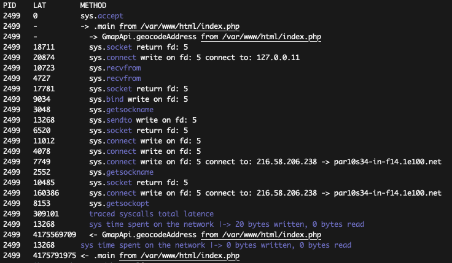

# PHP Tracing Tool

PHP tracing tool is a command line tool written in python 3 - based on the [BCC toolkit](https://github.com/iovisor/bcc) (eBPF) - for PHP code monitoring.

Built to help you understand your program behavior in a "normal" environment, directly in production.

It gives a deep observability of the application without adding specific php debugging code : function execution flow with latency of each function, tracing I/O syscalls with details …

You can also **monitor your containerized application** because it works on the PID of the php process, it discuss directly with the kernel (eBPF), there is **no impact on your application**. You just need a PHP compiled with the `--enable-dtrace` debug option (the image is in the repo)

This example trace a demo php program with a google maps API call.

## Command line options

**-h** : help

**-S** : print the syscalls details inside each function

**--check** : print the generated BPF C program and quit

**--debug** : debug mode: print the generated BPF C program

## Install an usage

Be sure to have BCC on your machine (a Debian Buster).

    apt-get install bpfcc-tools python3-bpfcc

Execute the script as root :

    sudo ./php_tool.py -h

## Complete Demo

Setup the vagrant machine and go in

    cd vagrant-buster && vagrant up
    vagrant ssh
    cd /vagrant/php_tool

Launch the PHP demo and nginx containers

    make

Instrumenting the code with php_tool

    sudo ./php_tool.py -S PID [PID ...]

Usage

    sudo ./php_tool.py

There is also a Wordpress demo image.

## Licence

Apache-2.0 © 2019 Nicolas Dubouilh, Mathieu Lecarme
